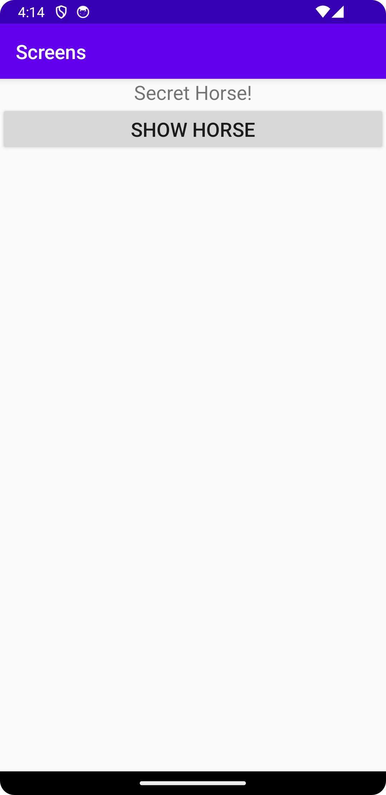

# Rapport

Först så skapades en ny klass och layout-fil genom att skapa en ny "Empty Views Activity".
Därefter lades en knapp till som ska kunna kopplas så att en ny activity startas när den klickas.

I filen activity_main.xml skapas knappen `<Button />` med id `android:id="@+id/showHorseButton"`

I MainActivity.java skapas eb binär knapp som sedan kopplas ihop med den knappen som skpades 
i xml-filen. Det görs genom att ange det id som knappen har i xml-filen vilket är "showHorseButton"
`Button horseButton = findViewById(R.id.showHorseButton);`

För att göra så att knappen blir klickbar så implementeras en listener på knappen
`horseButton.setOnClickListener(new View.OnClickListener() {});`
Skapat en knapp som ska lkopplas till att starta en activity.

## Följande grundsyn gäller dugga-svar:

- Ett kortfattat svar är att föredra. Svar som är längre än en sida text (skärmdumpar och programkod exkluderat) är onödigt långt.
- Svaret skall ha minst en snutt programkod.
- Svaret skall inkludera en kort övergripande förklarande text som redogör för vad respektive snutt programkod gör eller som svarar på annan teorifråga.
- Svaret skall ha minst en skärmdump. Skärmdumpar skall illustrera exekvering av relevant programkod. Eventuell text i skärmdumpar måste vara läsbar.
- I de fall detta efterfrågas, dela upp delar av ditt svar i för- och nackdelar. Dina för- respektive nackdelar skall vara i form av punktlistor med kortare stycken (3-4 meningar).

Programkod ska se ut som exemplet nedan. Koden måste vara korrekt indenterad då den blir lättare att läsa vilket gör det lättare att hitta syntaktiska fel.

```
function errorCallback(error) {
    switch(error.code) {
        case error.PERMISSION_DENIED:
            // Geolocation API stöds inte, gör något
            break;
        case error.POSITION_UNAVAILABLE:
            // Misslyckat positionsanrop, gör något
            break;
        case error.UNKNOWN_ERROR:
            // Okänt fel, gör något
            break;
    }
}
```

 
